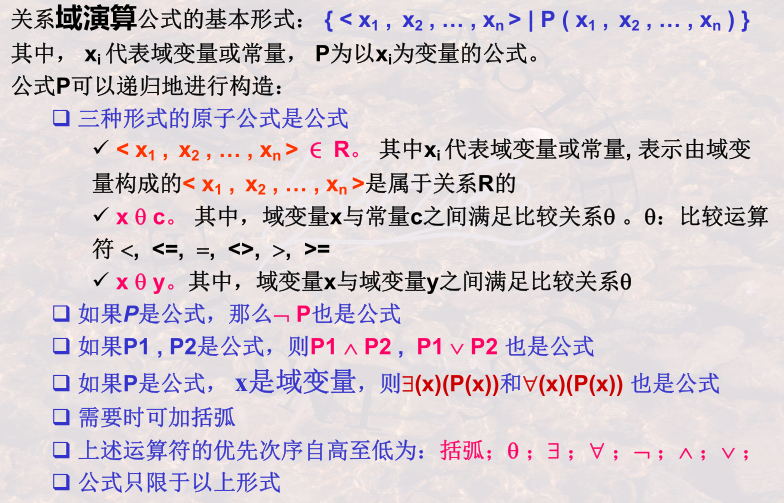

# 5. 关系模型之关系演算
重难点：

- 关系元组演算、域演算的递归定义
- 关系元组演算公式：与、或、非、存在、任意
- 用关系元组演算公式、QBE语言表达查询
- 关系元组演算、关系域演算和关系代数在表达查询方面的思维差异

## 5.1 关系元组演算
以元组变量作为谓词变量，基本形式：{t|P(t)}，可递归地构造。

### 存在量词与全称量词
- 检索学过所有课程的同学
- 检索所有同学所有课程都及格的系

### 元组演算的等价性变换
四个最复杂的例子：

- “全都学过”
	- 学过李明老师讲授所有课程的学生姓名
- “全没学过”
	- 没学过李明老师讲授任一门课程的学生姓名 
- “至少有一学过”
	- 至少学过一门李明老师讲授课程的学生姓名
- “至少有一没学过”
	- 至少有一门李明老师讲授课程没有学过的学生姓名

## 5.2 关系域演算
以域变量作为谓词变量，可递归构造。

### 基于关系域演算的QBE语言
- 关系名区、属性名区、操作命令区、查询条件区
- P.：显示输出、D.：删除、I.：插入、U.：更新
- 简单条件，不同属性上的与条件
- 示例元素实现与操作、或操作、多个表连接；
- 用QBE实现关系代数的并、差、乘积、选择和投影运算

## 5.3 关系演算之安全性

- 不产生无限关系和无穷验证的运算被称为是安全的。
- 关系代数是一种集合运算，是安全的
- 关系演算不一定安全，施加安全约束有限集合DOM
 
## 5.4 三种关系运算
- 三种运算之间是等价的。关系代数=安全的元组演算=安全的域演算
- 三种关系运算都可以说是非过程的。域>元组>关系代数。
- 三种关系运算虽是抽象的，但确实衡量数据库语言完备性的基础